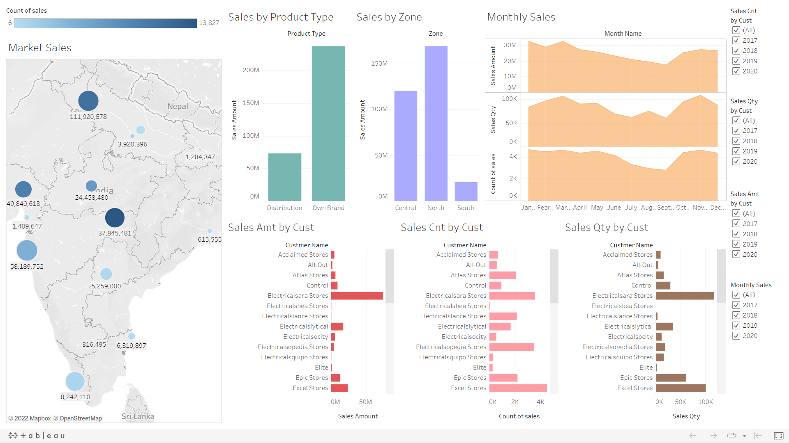
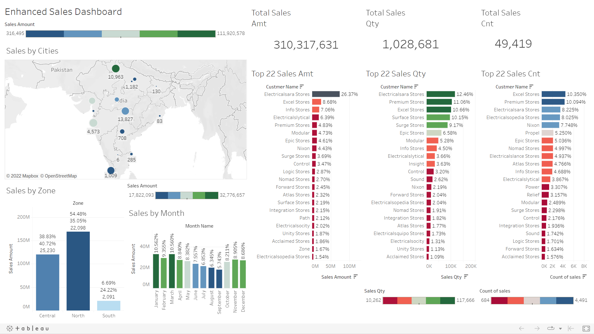

# Sales Analytics

Analysis of ALTIQ company sales dataset.

## Tech Stack


## Download

```bash
  git clone https://github.com/Onnamission/Sales-Analytics.git
```

## About

The original procedure applied on sales dataset was data insights using SQL and then using PowerBI for data cleaning and analysis.

Using SQL is good for insights but when it comes to data cleaning, the SQL code becomes very complex or when using codes on PowerBI. 

Too much of manual work. Writing so much code you know.

Now here comes the role on R where you just need to define a function in a pipline.

## Data Pipline in R

Defining data pipeline in R for data cleaning.

```bash
  data_clean = df %>%
    na_if(-1) %>%
    na_if(0) %>%
    na_if("") %>%
    drop_na()
```

## Dataset

The datset is about the sales record of company named ALTIQ. The dataset is in SQL format and contains 5 tables named as:
- Customers
- Data
- Markets
- Products
- Transactions

The dataset is in STAR SCHEMA format where transactions is the FACT tbale and others are dimension tables.

## Original Methodology
- Data insights using SQL.
- Data cleaning using PowerBI.
- Data visualization using PowerBI.

## My Methodology
- Data insights using SQL.
- Data cleaning using R programming.
- Data visualization using Tableau.

I used Tableau as it is used to process big dataset.

During the datainsghts, I joined all the dimension tables with the fact tables just to keep things simple and now we need to work with just single file.

I used INNER JOIN to combine all table but some redundant columns also came in. So removed those column during the pipline stage.  

## Cleaning Redundant Columns

Redundant columns came into due to INNER JOIN.

```bash
  data_clean = df %>%
    subset(select=-c(date, product_code_1, customer_code_1, markets_code))
```

## SQL Query

SQL query to join all tables into one.

```bash
  SELECT *
  FROM sales.transactions
  INNER JOIN sales.customer ON sales.transactions.customer_code = sales.customer.customer_code
  INNER JOIN sales.products ON sales.transactions.product_code = sales.products.product_code
  INNER JOIN sales.markets ON sales.transactions.market_code = sales.transaction.markets_code
  INNER JOIN sales.date ON sales.transactions.order_date = sales.date.date
```

## Redundancy in Currency

There were some redundancy in curreny column in transactions table like 
- USD & USD\r
- INR & INR\r

Further conversion from USD to INR where also performed.

```bash
  data_clean$currency[data_clean$currency == "INR\r"] = "INR"
  data_clean$currency[data_clean$currency == "USD\r"] = "INR"
```

## Visualizations

The visualization were made using Tableau.





## 🔗 Links
[](https://public.tableau.com/app/profile/aditya.kakde)

## Disclaimer

If you find same repository as this one without giving me acknowledgement:
- Go to my tableau profile
- Click on the dashboard related to this repository.
- Check the published date

The first published date is  Apr 18, 2022 and will remain that only.

If the code is same and dashboard is different, check for the measured values in the dashboard.

If you find date after the above date, it is copied without my repository acknowledgement.

Further, the code used in this repository is completely original and first published.

## Support

For support, find me 😂.

## Authors

- [@Onnamission](https://www.github.com/octokatherine)

## Acknowledgements

 - [Dataset](https://github.com/codebasics/DataAnalysisProjects/tree/master/1_SalesInsights)

